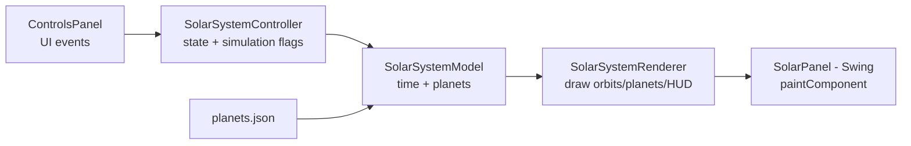

# Java Solar System (Swing)

Simple Java desktop simulation of the solar system with elliptical orbits, labels, controls, and a lightweight 3D-like projection.

## Tech Stack

- Java 25 by default (Gradle toolchain, override with `-PjavaVersion=21` if needed)
- Swing/AWT for UI and rendering
- Gradle (with wrapper)
- Jackson (JSON loading for planet data)
- JUnit 5 for unit tests

## Project Layout

- `src/main/java/com/raph/solarsystem/` - app entry point and UI wiring
- `src/main/java/com/raph/solarsystem/model/` - domain model + physics + JSON loader
- `src/main/java/com/raph/solarsystem/controller/` - simulation state/control logic
- `src/main/java/com/raph/solarsystem/view/` - renderer + controls panel
- `src/main/resources/planets.json` - planet dataset
- `src/test/java/com/raph/solarsystem/` - unit tests
- `docs/PLANET.md` - data documentation
- `docs/PHYSICS.md` - formulas and motion model
- `docs/ORBIT_ENGINE.md` - formula-to-code mapping

## Run

```bash
./gradlew run
```

If Java 25 is not installed locally, use:

```bash
./gradlew -PjavaVersion=21 run
```

## Test

```bash
./gradlew test
```

## Runtime Controls

- Speed slider and presets (`1x`, `10x`, `100x`)
- Pause/Resume, Reset
- 3D tilt toggle + strength slider
- Hover info toggle
- FPS slider + presets (`20`, `30`, `60`)
- Performance mode (reduced render cost)
- Zoom slider + `Fit`
- Mouse wheel zoom
- Keyboard zoom: `+`, `-`, `0` (fit)
- Language selector: English / French / Japanese

## Quick Math Glossary

- `a` (`semiMajorAu`): semi-major axis, orbit size (in AU).
- `e` (`eccentricity`): orbit shape (`0` circular, closer to `1` more elongated).
- `P` (`periodDays`): time for one full orbit (days).
- `n` (mean motion): average angular speed, `n = 2π / P`.
- `M` (mean anomaly): time-based orbital phase angle.
- `E` (eccentric anomaly): intermediate angle solving Kepler equation.
- `ν` (true anomaly): actual geometric angle of the planet from perihelion.
- Perihelion: closest distance to Sun, `a(1 - e)`.
- Aphelion: farthest distance from Sun, `a(1 + e)`.

For details and formulas, see `docs/PHYSICS.md` and `docs/ORBIT_ENGINE.md`.

## Design Pattern (High-Level)

- Model-Controller-View split:
  - **Model**: planet data and orbital calculations
  - **Controller**: mutable simulation settings and time progression
  - **View**: rendering and UI controls

## Architecture Flow



Quick read:
- `ControlsPanel` updates controller settings (speed, fps, tilt, zoom, etc.)
- `SolarPanel` timer ticks call controller/model progression
- `SolarSystemRenderer` reads model + render context and draws the frame
- `planets.json` is the source of orbital/display data
